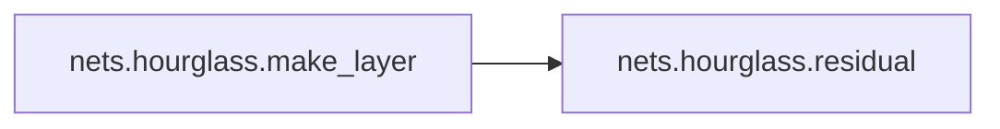
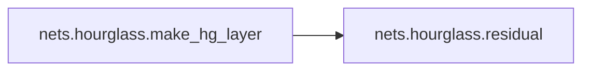
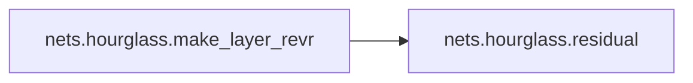

# Nets Hourglass

[_Documentation generated by Documatic_](https://www.documatic.com)

<!---Documatic-section-Codebase Structure-start--->
## Codebase Structure

<!---Documatic-block-system_architecture-start--->
```mermaid
None
```
<!---Documatic-block-system_architecture-end--->

# #
<!---Documatic-section-Codebase Structure-end--->

<!---Documatic-section-nets.hourglass.make_layer-start--->
## [nets.hourglass.make_layer](4-nets_hourglass.md#nets.hourglass.make_layer)

<!---Documatic-section-make_layer-start--->


### Object Calls

* nets.hourglass.residual

<!---Documatic-block-nets.hourglass.make_layer-start--->
<details>
	<summary><code>nets.hourglass.make_layer</code> code snippet</summary>

```python
def make_layer(k, inp_dim, out_dim, modules, **kwargs):
    layers = [residual(k, inp_dim, out_dim, **kwargs)]
    for _ in range(modules - 1):
        layers.append(residual(k, out_dim, out_dim, **kwargs))
    return nn.Sequential(*layers)
```
</details>
<!---Documatic-block-nets.hourglass.make_layer-end--->
<!---Documatic-section-make_layer-end--->

# #
<!---Documatic-section-nets.hourglass.make_layer-end--->

<!---Documatic-section-nets.hourglass.make_hg_layer-start--->
## [nets.hourglass.make_hg_layer](4-nets_hourglass.md#nets.hourglass.make_hg_layer)

<!---Documatic-section-make_hg_layer-start--->


### Object Calls

* nets.hourglass.residual

<!---Documatic-block-nets.hourglass.make_hg_layer-start--->
<details>
	<summary><code>nets.hourglass.make_hg_layer</code> code snippet</summary>

```python
def make_hg_layer(k, inp_dim, out_dim, modules, **kwargs):
    layers = [residual(k, inp_dim, out_dim, stride=2)]
    for _ in range(modules - 1):
        layers += [residual(k, out_dim, out_dim)]
    return nn.Sequential(*layers)
```
</details>
<!---Documatic-block-nets.hourglass.make_hg_layer-end--->
<!---Documatic-section-make_hg_layer-end--->

# #
<!---Documatic-section-nets.hourglass.make_hg_layer-end--->

<!---Documatic-section-nets.hourglass.make_layer_revr-start--->
## [nets.hourglass.make_layer_revr](4-nets_hourglass.md#nets.hourglass.make_layer_revr)

<!---Documatic-section-make_layer_revr-start--->


### Object Calls

* nets.hourglass.residual

<!---Documatic-block-nets.hourglass.make_layer_revr-start--->
<details>
	<summary><code>nets.hourglass.make_layer_revr</code> code snippet</summary>

```python
def make_layer_revr(k, inp_dim, out_dim, modules, **kwargs):
    layers = []
    for _ in range(modules - 1):
        layers.append(residual(k, inp_dim, inp_dim, **kwargs))
    layers.append(residual(k, inp_dim, out_dim, **kwargs))
    return nn.Sequential(*layers)
```
</details>
<!---Documatic-block-nets.hourglass.make_layer_revr-end--->
<!---Documatic-section-make_layer_revr-end--->

# #
<!---Documatic-section-nets.hourglass.make_layer_revr-end--->

[_Documentation generated by Documatic_](https://www.documatic.com)