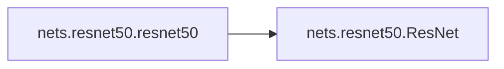

# Nets Resnet50

[_Documentation generated by Documatic_](https://www.documatic.com)

<!---Documatic-section-Codebase Structure-start--->
## Codebase Structure

<!---Documatic-block-system_architecture-start--->
```mermaid
None
```
<!---Documatic-block-system_architecture-end--->

# #
<!---Documatic-section-Codebase Structure-end--->

<!---Documatic-section-nets.resnet50.resnet50-start--->
## [nets.resnet50.resnet50](5-nets_resnet50.md#nets.resnet50.resnet50)

<!---Documatic-section-resnet50-start--->


### Object Calls

* nets.resnet50.ResNet

<!---Documatic-block-nets.resnet50.resnet50-start--->
<details>
	<summary><code>nets.resnet50.resnet50</code> code snippet</summary>

```python
def resnet50(pretrained=True):
    model = ResNet(Bottleneck, [3, 4, 6, 3])
    if pretrained:
        state_dict = load_state_dict_from_url(model_urls['resnet50'], model_dir='model_data/')
        model.load_state_dict(state_dict)
    features = list([model.conv1, model.bn1, model.relu, model.maxpool, model.layer1, model.layer2, model.layer3, model.layer4])
    features = nn.Sequential(*features)
    return features
```
</details>
<!---Documatic-block-nets.resnet50.resnet50-end--->
<!---Documatic-section-resnet50-end--->

# #
<!---Documatic-section-nets.resnet50.resnet50-end--->

[_Documentation generated by Documatic_](https://www.documatic.com)